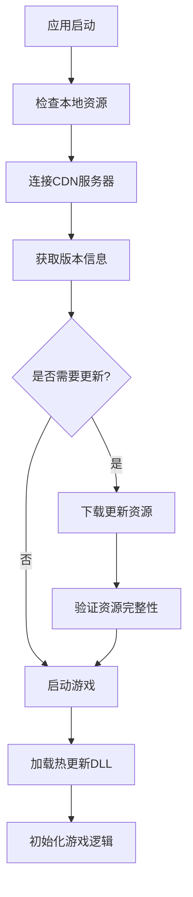

# 2022HotFixTemplate


# Unity弱联网热更新方案模板项目 (Momo HotFix Template)

## 📝 项目概述

这是一个基于Unity的完整热更新解决方案模板，整合了现代化的技术栈，提供了从客户端到CDN的完整热更新流程。项目采用分层架构设计，支持代码热更新和资源热更新，适用于商业级游戏开发。

## 🏗️ 整体架构

### 核心架构组件

- **热更新引擎**: HybridCLR - C#代码热更新解决方案
- **资源管理**: YooAsset - 现代化的资源管理和热更新系统  
- **架构框架**: QFramework - MVC架构模式和模块化管理
- **异步编程**: UniTask - 高性能异步任务框架
- **UI组件**: ProceduralUIImage - 程序化UI图像组件
- **动画系统**: DOTween - 高效的补间动画库

### 技术栈

| 技术 | 版本 | 用途 |
|------|------|------|
| Unity | 2022.x+ | 游戏引擎 |
| HybridCLR | 4.x | C#代码热更新 |
| YooAsset | 2.1.2+ | 资源管理与热更新 |
| QFramework | 1.0+ | 架构框架 |
| UniTask | 最新版 | 异步编程 |
| DOTween | 最新版 | 动画系统 |

## 📁 项目目录结构

```
Momo_HotFixTemplateGit/
├── _CDN/                           # CDN资源分发目录
│   ├── Android/                    # 安卓平台资源
│   ├── IPhone/                     # iOS平台资源  
│   ├── PC/                         # PC平台资源
│   └── WebGL/                      # WebGL平台资源
├── Assets/
│   ├── [0]Cilent/                  # 热更新客户端资源
│   │   ├── Code/                   # 热更新代码DLL
│   │   ├── Config/                 # 配置文件
│   │   ├── Scenes/                 # 游戏场景
│   │   ├── Scripts/
│   │   │   ├── [0]Main/           # 主工程代码
│   │   │   │   ├── [0]Model/      # 数据模型层
│   │   │   │   ├── [1]Core/       # 核心功能层
│   │   │   │   └── [2]Tool/       # 工具类
│   │   │   └── [1]HotFix/         # 热更新业务代码
│   │   │       ├── [0]HotModel/   # 热更新数据模型
│   │   │       ├── [1]Command/    # 命令模式
│   │   │       ├── [2]System/     # 系统模块
│   │   │       ├── [3]GameController/ # 游戏控制器
│   │   │       ├── [4]UI/         # UI界面
│   │   │       └── [5]Utility&Tool/ # 热更新工具
│   │   ├── Textures/              # 纹理资源
│   │   ├── Prefabs/               # 预制体
│   │   └── UI/                    # UI资源
│   ├── [1]Local/                   # 本地资源(不热更新)
│   │   ├── CodeMetadata/          # 本地元数据
│   │   ├── Scenes/                # 本地场景
│   │   └── UI/                    # 本地UI
│   ├── Settings/YooAssetSetting/   # YooAsset配置
│   ├── HybridCLRGenerate/          # HybridCLR生成文件
│   └── Editor/                     # 编辑器工具
└── ProjectSettings/                # Unity项目设置
```

## 🔥 热更新架构设计

### 分层架构

项目采用严格的分层架构，确保热更新的稳定性和可维护性：

#### 1. 本地层 ([1]Local)
- **功能**: 不需要热更新的基础资源和代码
- **内容**: 启动场景、基础UI、元数据文件
- **特点**: 随客户端发布，稳定不变

#### 2. 热更新层 ([0]Client)  
- **功能**: 可以动态更新的业务逻辑和资源
- **内容**: 游戏核心逻辑、UI界面、配置数据
- **特点**: 可通过CDN动态更新

### 热更新流程



## 🚀 快速开始

### 环境要求

- Unity 2022.3 LTS 或更高版本
- .NET Framework 4.x
- 支持的平台: Windows, macOS, iOS, Android, WebGL

### 安装步骤

1. **克隆项目**
```bash
git clone https://github.com/your-repo/Momo_HotFixTemplateGit.git
cd Momo_HotFixTemplateGit
```

2. **打开Unity项目**
- 使用Unity Hub打开项目
- 等待项目导入完成

3. **配置HybridCLR**
- 菜单: `HybridCLR/Installer`
- 安装HybridCLR组件

4. **配置YooAsset**
- 检查 `Assets/Settings/YooAssetSetting/AssetBundleCollectorConfig.xml`
- 根据需要调整资源收集配置

### 开发工作流

#### 1. 本地开发
```csharp
// 在LoadDll.cs中设置开发模式
public EPlayMode PlayMode = EPlayMode.EditorSimulateMode;
```

#### 2. 热更新代码开发
- 业务逻辑代码放在 `[1]HotFix` 目录下
- 遵循QFramework的MVC架构模式
```csharp
// 示例：创建热更新控制器
public class GameController : MonoBehaviour, IController
{
    public IArchitecture GetArchitecture()
    {
        return HotFixTemplateArchitecture.Interface;
    }
}
```

#### 3. 资源打包
- 使用编辑器工具: `Build2AsyncCDN`
- 选择需要更新的包进行构建
- 自动上传到CDN

## 🔧 核心组件详解

### 1. 资源加载工具 (LoadYooAssetsTool)

```csharp
// 加载资源示例
var texture = await LoadYooAssetsTool.LoadAsset<Texture2D>("example.png");
var prefab = await LoadYooAssetsTool.LoadAsset<GameObject>("UIPrefab", isLocal: false);

// 加载场景
LoadYooAssetsTool.LoadSceneAsync("GameScene").Forget();
```

### 2. 热更新DLL加载 (LoadDll)

- 自动检测和下载热更新内容
- 支持多种运行模式切换
- 提供进度回调和错误处理

### 3. CDN资源分发

- 支持多平台资源分发
- 版本控制和增量更新
- 自动化构建和部署流程

## 📱 平台支持

| 平台 | 状态 | 说明 |
|------|------|------|
| Windows | ✅ 完全支持 | PC端完整功能 |
| macOS | ✅ 完全支持 | Mac端完整功能 |
| iOS | ✅ 完全支持 | 需要配置证书 |
| Android | ✅ 完全支持 | 支持ARM64和ARMv7 |
| WebGL | ⚠️ 部分支持 | 热更新功能受限 |

## ⚙️ 配置说明

### YooAsset配置

项目包含4个资源包配置：

1. **DefaultPackage**: 主要热更新资源包
2. **RawFilePackage**: 热更新代码包  
3. **LocalDefaultPackage**: 本地资源包
4. **LocalRawFilePackage**: 本地代码包

### HybridCLR配置

- **AOT程序集**: 自动生成AOT泛型引用
- **热更新程序集**: HotFix.dll
- **链接配置**: link.xml保护必要类型

## 📋 编码规范

项目遵循统一的命名规范：

```csharp
// 变量命名规范
u32 ulValue;        // u32类型使用ul前缀
u16 usValue;        // u16类型使用us前缀  
u8 ucValue;         // u8类型使用uc前缀
struct stData;      // 结构体使用st前缀
bit bFlag;          // 位变量使用b前缀
pointer pData;      // 指针使用p前缀
global g_Value;     // 全局变量使用g_前缀
static s_Value;     // 静态变量使用s_前缀
```

## 🧪 测试和调试

### 热更新测试流程

1. **本地测试**: 使用EditorSimulateMode
2. **包体测试**: 构建测试包验证热更新流程
3. **CDN测试**: 验证远程资源下载功能

### 调试工具

- **YooAsset调试器**: 运行时资源状态监控
- **HybridCLR日志**: 代码加载状态追踪
- **自定义调试面板**: 热更新状态显示


## 📄 许可证

本项目采用 [MIT 许可证](LICENSE)

## 📞 技术支持

如有技术问题，请通过以下方式联系：

- 提交 MomoTyan
- 发送邮件至: momo2386199126@gmail.com
- QQ: 23861199126

## 🔗 相关链接

- [HybridCLR官方文档](https://hybridclr.doc.code-philosophy.com/)
- [YooAsset官方文档](https://www.yooasset.com/)  
- [QFramework官方文档](https://qframework.cn/)
- [UniTask官方仓库](https://github.com/Cysharp/UniTask)

---

**注意**: 这是一个热更新模板项目，建议在商业项目中使用前进行充分的测试和优化。
